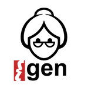

# YaYaGen - Yet Another Yara Rule Generator

[](https://opensource.org/licenses/BSD-2-Clause)




## NEWS

YaYaGen is in [Las Vegas](https://jimmy-sonny.github.io/LasVegas18/)!

*"Looking for the perfect signature: an automatic YARA rules generation algorithm in the AI-era"*
* [BSIDESLV](https://www.bsideslv.org/schedule/): 8th of August, 15:30, at Tuscany Suites (Firenze). Track Ground Truth.
* [DEF CON 26](https://www.defcon.org/html/defcon-26/dc-26-speakers.html#Marcelli): 11th of August, 13:00, at Caesars Palace (Forum Ballroom). Track Three.

[Contact](https://twitter.com/_S0nn1_) Andrea for some free stickers of your favourite grandma.

## Getting Started

*YaYaGen* is an automatic procedure, that starts from a set of *Koodous* reports ([example](_sample_analysis_json/0001eaa3e2045867d857e6b7c837f3476fb1f659fbe4eda9b1f25af15b132475.json)), either identified as a malware family, or by any other mean, and eventually produces a signature in the form of a [YARA](https://virustotal.github.io/yara/) rule that can be seamlessly used in [Koodous](https://koodous.com/). YaYaGen analyzes the reports of the target applications, extract the analysis attributes, and identifies an optimal attribute subsets that are able to match all the targets; moreover, thanks to a heuristic measure, the generated signature has a limited risk of detecting false positive in the future, yet it is general enough to catch future threats.

The alghoritm is originally described in "Countering Android Malware: a Scalable Semi-Supervised Approach for Family-Signature Generation" (DOI: [N/A](), article under review).

### Install

YaYaGen requires Python 3.4 or greater.

#### Clone the repository
```
git clone https://github.com/jimmy-sonny/YaYaGen
```

#### PyJq 
Installing [PyJq](https://pypi.python.org/pypi/pyjq) requires *automake* and *libtool*

For OSX users:
```
brew install automake
brew install libtool
```

#### Python packages

To install the required python3 packages:
```
pip3 install -r requirements.txt
```

#### Set your VT api (optional)

```
export VTAPI=your_vt_api
```

### How to use YaYaGen

```
__  __   __  __     _____
\ \/ /__ \ \/ /__ _/ ___/__ ___   YaYaGen -- Yet Another Yara Rule Generator
 \  / _ `/\  / _ `/ (_ / -_) _ \  (!) v0.5_summer18
 /_/\_,_/ /_/\_,_/\___/\__/_//_/  by Andrea Marcelli & Giovanni Squillero

usage: YaYaGen [-h] [-d] [-ndb] [-dry] [-a ALGORITHM] [-opt OPTIMIZER]
               [-u URL] [-dir DIRECTORY] [-f FILTER] [-o OUTPUTDIR]
               [-name RULENAME]
               [sha256 [sha256 ...]]

Yet another YARA rule Generator

positional arguments:
  sha256                sha256 APK list

optional arguments:
  -h, --help            show this help message and exit
  -d, --debug           log level debug
  -ndb, --no-db         disable DB
  -dry, --dryrun        parse inputs and exit
  -a ALGORITHM, --algorithm ALGORITHM
                        [greedy, clot]
  -opt OPTIMIZER, --optimizer OPTIMIZER
                        [basic, evo]
  -u URL, --url URL     koodous URL
  -dir DIRECTORY, --directory DIRECTORY
                        directory with Koodous reports
  -f FILTER, --filter FILTER
                        filter reports in input (one sha256 or filename per
                        line)
  -o OUTPUTDIR, --outputdir OUTPUTDIR
                        save generated rules to outputdir
  -name RULENAME, --rulename RULENAME
                        YARA rule name
```

YaYaGen accepts Koodous JSON reports both by specifying a directory through the *-d* option. Alternatively, it is possible to directly download them using a Koodous search APK URL (e.g., https://koodous.com/apks?search=tag:bankbot%20AND%20date:%3E2018-06-10). Internally reports are stored in an intermediate representation (a set of Python tuples) and cached in a SQLite DB (reports.sqlite3) created locally. To invalidate the cache, use the *-ndb* option.

YaYaGen builds each Yara rule by selecting a suitable set of clauses, then picks a subset of them of variable size to build an optimal family signature.
The current implementation provides two possible algorithms:
* *greedy*: select the clauses using a greedy algorithm
* *clot*: select the clauses using a dynamic greedy algorithm *[best chioce]*

and two possibile rule optimization strategies:
* *basic*: random based
* *evo*: based on EA **Available soon**

YaYaGen uses several configuration files to set various options. The [configuration.json](_config/configuration.json) allows to enable Cuckoo support, specify Permission and Intent filters list, *keywords* and *values* files. [keywords.json](_config/keywords.json) is used at the preprocessing of the Koodous json reports to select which literal consider during the rule generation process, while [values.json](_config/values.json) is used to specify the weight of each literal.

Since urls and ip addresses are very effective in detecting malicious samples, they are filtered and checked for maliciousness before beeing included in the set of literals used for the rule generation. The module incharged of preprocessing them is the [url_checker.py](yayagen/url_checker.py), which firstly filters common urls using the Alexa Top 1 million list ([alexa](_top_domains/top-1m.csv)), and then uses Virus Total API to check the domain for malicious traffic. Results are cached in a SQLite DB (detections.sqlite3) created locally.


### Examples

Generate one YARA rule for each sample in the *[_sample_analysis_json](_sample_analysis_json)* directory:
```
./yyg.py -d -dry -dir _sample_analysis_json
```


Generate a YARA rule to cover all the samples in input, using *clot* algorithm and *basic* optimizer:
```
./yyg.py -d -a clot -opt basic -dir _sample_analysis_json
```


Generate a YARA rule to match all the samples from the Koodous search query: [*"tag:bankbot AND date:>2018-06-10"*](https://koodous.com/apks?search=tag:bankbot%20AND%20date:%3E2018-06-10)
```
./yyg.py -d -name bankbot -o bankbot_rule --url https://koodous.com/apks?search=tag:bankbot%20AND%20date:%3E2018-06-10
```


Generate a YARA rule to match the two applications in input. (APK reports are downloaded from Koodous).
```
./yyg.py accd05c00951ef568594efebd5c30bdce2e63cee9b2cdd88cb705776e0a4ca70 e6aba7629608a525b020f4e76e4694d6d478dd9561d934813004b6903d66e44c
```

## Rule Quality

The score of a rule is inversely related to its generality and it is defined as the minimum weight (i.e. most generic) among its clauses, on the other hand the weight of a clause is calculated as the sum of the weights of its literals. The higher the score, the more a rule will be specific and less susceptible to generate false positives. The lower the score, the more a rule will be able to generalize, while more prone to unwanted detections. In order to find a balance between the two cases, and build effective rules, we introduce a double threshold *Tmin* and *Tmax*, where the lowest is the minimum score that a rule needs to be valid, and the highest is used in the optimization process to avoid producing overly-specific rulesets.

For more information, please refer to the article "Countering Android Malware: a Scalable Semi-Supervised Approach for Family-Signature Generation" (DOI: [N/A](), article under review)).


### Tuning

In order to experiment the rules creation with different settings, the weight of each literal and the two thresholds can be configured in [values.json](_config/values.json).


## Next steps

YaYaGen is still under active development. Several extensions will be available soon.

* *evo* optimizer
* *FP* exclusion
* YARA rule parser (for attribute weights optimization)

* **YaYaGenPE** a new YaYaGen version to automatically generate YARA signatures for Windows PE files.


## Contacts

Feel free to contact [Andrea Marcelli](https://jimmy-sonny.github.io/) for any ideas, improvements, and questions.

email:
* andrea.marcelli *at* polito.it
* amarcelli *at* hispasec.com

twitter: [@_S0nn1_](https://twitter.com/_S0nn1_)


## Licensing

**Copyright © 2017 [Andrea Marcelli](https://jimmy-sonny.github.io/) & [Giovanni Squillero](http://staff.polito.it/giovanni.squillero/).**

Thanks to the whole Hispasec team, [@entdark_](https://twitter.com/entdark_?lang=es), and [@plusvic](https://twitter.com/plusvic?lang=es) for their support and insightful comments.

*YaYaGen* is licensed under the 2-Clause BSD License ([BSD-2-Clause](https://opensource.org/licenses/BSD-2-Clause)).